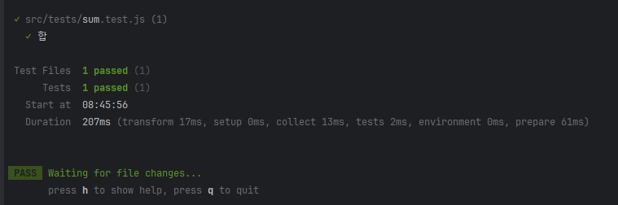

# vitest-example

---

### vitest 란?

- vite 환경에서 동작하는 테스트 프레임워크
- 사이트를 가보면, 빠르다라는걸 강조하고 있다.
- Jest 와의 호환성을 중시하기 떄문에, 마이그레이션이 간단하다.

---

### 프로젝트 구성

```
npm init -y
```

```
npm i -D vitest
```

- src 폴더 및 tests 폴더 생성
```
mkdir src
cd src
mkdri tests
```

- package.json scripts 를 아래와 같이 수정
```
"scripts": {
    "test": "vitest"
},
```

---

### 샘플 테스트 작성

- src 아래에 sum 함수 작성
```
// src/sum.js
export function sun(a, b) {
    return a + b;
}
```

- src/tests 아래에 테스트 코드 작성
```
// src/tests/sum.test.js
import {expect, test} from "vitest";
import {sun} from "../sum";

test('합', () => {
   expect(sun(1,1)).toBe(2);
});
```

- `npm run test`



---

### 설정

- vite 으로 구성한 프로젝트라면, vite.config.js 로 설정이 가능
- vite 프로젝트가 아니라면, vitest.config.js 로 설정이 가능

```
import { defineConfig } from 'vitest/config'

export default defineConfig({
  test: {
    // ...
  },
})
```

- vitest 공식 문서를 살펴보면, vite 과 vitest 설정을 별도로 하는 경우에 vite 프로젝트 환경에서 동일한 옵션을 정의해야 한다고 되어있다. mergeConfig 메소드를 사용하여 병합하여 재정의하라고 되어있다.
```
// vite.config.js
import { defineConfig } from 'vite'
import Vue from '@vitejs/plugin-vue'

export default defineConfig({
  plugins: [Vue()],
})
```
```
// vitest.config.js
import { defineConfig, mergeConfig } from 'vitest/config'
import viteConfig from './vite.config.mjs'

export default mergeConfig(viteConfig, defineConfig({
  test: {
    // ...
  }
}))
```

- config 파일이 다른 위치에 있다면, `vitest --config ./path/other.config.js` 형식으로 사용이 가능하다.