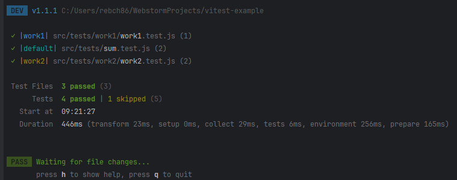

# vitest-example

---

### vitest 란?

- vite 환경에서 동작하는 테스트 프레임워크
- 사이트를 가보면, 빠르다라는걸 강조하고 있다.
- Jest 와의 호환성을 중시하기 떄문에, 마이그레이션이 간단하다.

---

### 프로젝트 구성

```
npm init -y
```

```
npm i -D vitest
```

- src 폴더 및 tests 폴더 생성
```
mkdir src
cd src
mkdri tests
```

- package.json scripts 를 아래와 같이 수정
```
"scripts": {
    "test": "vitest"
},
```

---

### 샘플 테스트 작성

- src 아래에 sum 함수 작성
```
// src/sum.js
export function sun(a, b) {
    return a + b;
}
```

- src/tests 아래에 테스트 코드 작성
```
// src/tests/sum.test.js
import {expect, test} from "vitest";
import {sun} from "../sum";

test('합', () => {
   expect(sun(1,1)).toBe(2);
});
```

- `npm run test`


---

### 설정

- vite 으로 구성한 프로젝트라면, vite.config.js 로 설정이 가능
- vite 프로젝트가 아니라면, vitest.config.js 로 설정이 가능

```
import { defineConfig } from 'vitest/config'

export default defineConfig({
  test: {
    // ...
  },
})
```

- vitest 공식 문서를 살펴보면, vite 과 vitest 설정을 별도로 하는 경우에 vite 프로젝트 환경에서 동일한 옵션을 정의해야 한다고 되어있다. mergeConfig 메소드를 사용하여 병합하여 재정의하라고 되어있다.
```
// vite.config.js
import { defineConfig } from 'vite'
import Vue from '@vitejs/plugin-vue'

export default defineConfig({
  plugins: [Vue()],
})
```
```
// vitest.config.js
import { defineConfig, mergeConfig } from 'vitest/config'
import viteConfig from './vite.config.mjs'

export default mergeConfig(viteConfig, defineConfig({
  test: {
    // ...
  }
}))
```

- config 파일이 다른 위치에 있다면, `vitest --config ./path/other.config.js` 형식으로 사용이 가능하다.

---

### 작업공간(workspace)

- 작업 공간을 할당하여, 동일한 프로젝트내에서도 다양한 테스트 구성을 하여 실행
- vitest.workspace.js 에서 설정이 가능

```
import { defineWorkspace } from 'vitest/config'

// defineWorkspace provides a nice type hinting DX
export default defineWorkspace([
  'packages/*',
  {
    // add "extends" to merge two configs together
    extends: './vite.config.js',
    test: {
      include: ['tests/**/*.{browser}.test.{ts,js}'],
      // it is recommended to define a name when using inline configs
      name: 'happy-dom',
      environment: 'happy-dom',
    }
  },
  {
    test: {
      include: ['tests/**/*.{node}.test.{ts,js}'],
      name: 'node',
      environment: 'node',
    }
  }
])
```

```
import {defineWorkspace} from "vitest/config";

export default defineWorkspace([
    {
        test: {
            include: ['src/tests/*.test.{js,ts}'],
            name: 'default',
            environment: 'node'
        }
    },
    {
        test: {
            include: ['src/tests/work1/*.test.{js,ts}'],
            name: 'work1',
            environment: 'node'
        }
    },
    {
        test: {
            include: ['src/tests/work2/*.test.{js,ts}'],
            name: 'work2',
            environment: 'jsdom'
        }
    }
])
```
- 위와 같이 작성을 하였으며, jsdom 패키지를 추가해줘야한다. `npm i -D jsdom`

---

### watch

- vitest 는 기본적으로, watch 모드로 실행이 됩니다.

---

### skip

- test 를 건너뜁니다.
- only, todo 도 있습니다만, 생략하겠습니다.

```
import {expect, test} from "vitest";
import {sun} from "../sum";

test('합', () => {
   expect(sun(1,1)).toBe(2);
});

test.skip('뺄셈', () => {
       // skip test
});
```



---

### Mocking

- 가짜 데이터 또는 객체 함수를 작성합니다. jest 와 사용법이 동일합니다.
- vitest 패키지에서 제공해주는 `vi` 를 사용하여 생성

```
const fakeFn = vi.fn();
fakeFn('hello vi');

const fakeFn2 = vi.fn(num => num * 2);

test('mocking', () => {
   expect(vi.isMockFunction(fakeFn)).toBe(true);
   // .mock.calls[호출 순서][인자 순서]
   expect(fakeFn.mock.calls[0][0]).toBe('hello vi');

   fakeFn2(10);
   fakeFn2(20);
   // 첫번째 호출의 첫번째 인자 값은
   expect(fakeFn2.mock.calls[0][0]).toBe(10);
   // 두번째 호출의 첫번째 인자 값은
   expect(fakeFn2.mock.calls[1][0]).toBe(20);

   // 첫번째 호출의 결과값은 20
   expect(fakeFn2.mock.results[0].value).toBe(20);
   // 두번째 호출의 결과값은 40
   expect(fakeFn2.mock.results[1].value).toBe(40);

   // fakeFn2 는 총 2번 호출
   expect(fakeFn2.mock.results.length).toBe(2);
})
```